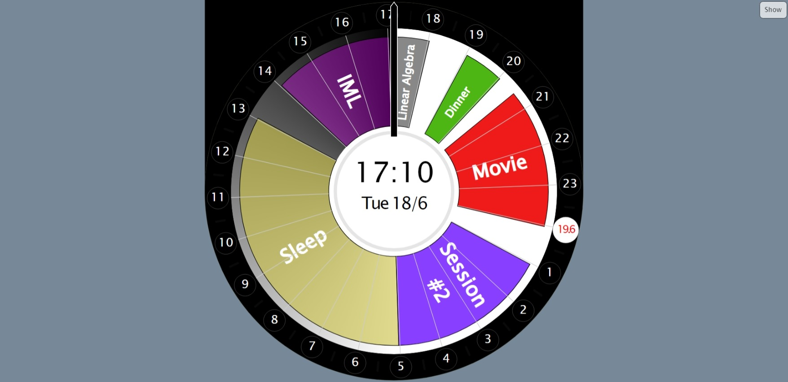

**Clocker** is a web application day planner providing a new way to visualize your daily tasks. Instead of a traditional linear schedule, you can plan your day 24 hours ahead, in such a way you always know what you do a day from now. Traditional planners for a day start and end at midnight; but what if you're a night owl needing to plan an event from 23:00 to 3:00? Clocker makes no assumptions when it comes to the structure of your day. It always points to the present time and gives a circular view of the next 24 hours. You do you.

<a href="https://iwarshavsky.github.io/clocker/">https://iwarshavsky.github.io/clocker/</a>

Techonologies used: Javascript and SVG, PHP for backend.

